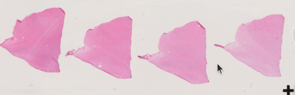
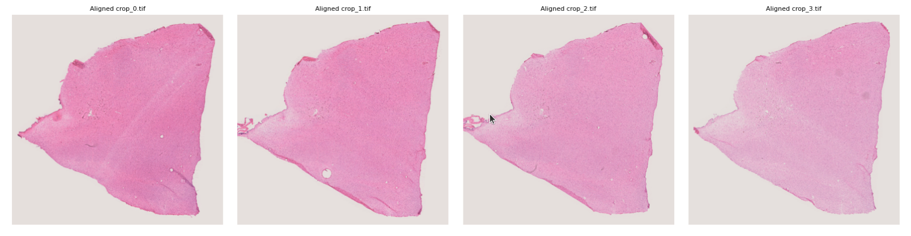

# Automatic Cropping and Alignment of H&E tissue sections

## Prerequists and Installation

## Notebooks Workflow
---

## Workflow Overview

Below is an example of each major stage:

| Stage               | Example                                      |
|---------------------|----------------------------------------------|
| **Input Image**     |                    |
| **Mask**            |                     |
| **Aligned Output**  |                 |

---

## Notebooks

### 0) images_to_downscaled_masks.ipynb

- **Purpose**: 
- **Inputs**:
  - Folder of raw `.tif` or `.png` images.
  - Threshold and size-filter parameters defined in the notebook.
- **Outputs**:
  - `downscaled_masks/` folder containing downsampled mask `.tif` files.
- **Key Steps**:
  1. 

### 1) get_bounding_box_crop.ipynb

- **Purpose**: From downsampled masks, compute bounding boxes for each object and crop corresponding patches from the original full-resolution images.
- **Inputs**:
  - Original images folder.
  - Corresponding downscaled masks folder.
  - Margin parameter for bounding box extension.
- **Outputs**:
  - `crops/` folder with one image patch per object (as `.png` or `.npy`).
- **Key Steps**:
  1. Read each mask and compute `x_min, x_max, y_min, y_max` for every object, with optional margin.
  2. Sort bounding boxes left-to-right.
  3. Crop the original image per bounding box and fill background pixels with the channel-wise mode color.

### 2) align_all_images_in_folder.ipynb

- **Purpose**: Align a series of image crops (e.g. serial sections) to a reference using an affine ECC-based registration.
- **Inputs**:
  - Folder of cropped image patches (from step 1).
  - Downsample factor `ds` used previously.
- **Outputs**:
  - `aligned_steps/` folder with `.png` or `.npy` aligned at full resolution.
- **Key Steps**:
  1. Load each pair of downsampled masks and estimate affine 2×3 warp via ECC.
  2. Upscale the warp translation back to full resolution.
  3. Compute border color (mode of RGB channels) and apply `cv2.warpAffine` to the full-res image.
